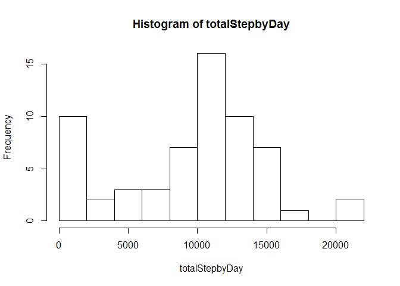
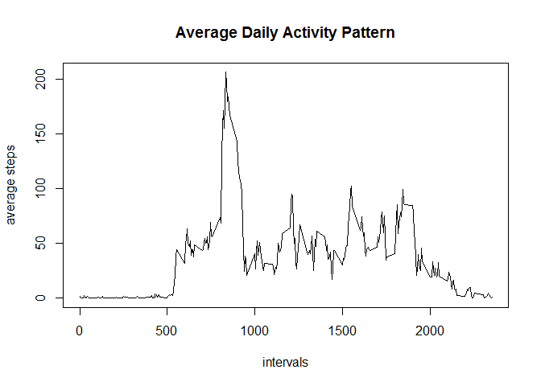
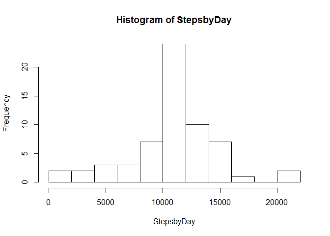
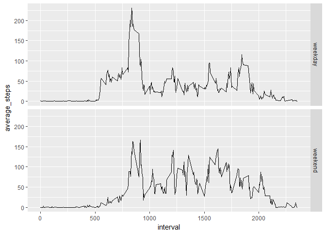

## Loading and preprocessing the data
Here is the code for loading data

```r
Mydata <- read.csv(file = "C:/Users/yzhang/Documents/GitHub/RepData_PeerAssessment1/activity/activity.csv", header = TRUE, sep = ",")
```
## What is mean total number of steps taken per day?
Here is the code to calculate the total steps

```r
totalStepbyDay <- tapply(Mydata$steps, Mydata$date, sum, na.rm = TRUE)
```
Below is the code to generate the histogram

```r
hist(totalStepbyDay, breaks = 10)
```

<!-- -->
Below is the code for calculating the mean and its output

```r
Mymean <- mean(totalStepbyDay)
print(Mymean, type = "html")
```

```
## [1] 9354.23
```
Below is the code for calculating the median and its output

```r
Mymedian <- median(totalStepbyDay)
print(Mymedian, type = "html")
```

```
## [1] 10395
```

## What is the average daily activity pattern?
Below is the code for calculate the average steps grouping by intervals.

```r
library(dplyr)
```

```
## 
## Attaching package: 'dplyr'
```

```
## The following objects are masked from 'package:stats':
## 
##     filter, lag
```

```
## The following objects are masked from 'package:base':
## 
##     intersect, setdiff, setequal, union
```

```r
StepsbyInterval <- Mydata %>%
  group_by(interval) %>%
  summarise(average_steps = mean(steps, na.rm = TRUE))
```
Plot the data

```r
with(StepsbyInterval, plot(interval, average_steps, type = "l", xlab = "intervals", ylab = "average steps", main = "Average Daily Activity Pattern"))
```

<!-- -->
Report which 5-minute interval contains the maximum number of steps.

```r
MaxiumStepsbyInterval <- StepsbyInterval[StepsbyInterval$average_steps == max(StepsbyInterval$average_steps), ]
print(MaxiumStepsbyInterval, type = "html")
```

```
## # A tibble: 1 x 2
##   interval average_steps
##      <int>         <dbl>
## 1      835          206.
```

## Imputing missing values

Report number of rows with NAs.

```r
NumberofNAs <- sum(is.na(Mydata$steps))
print(NumberofNAs, type = "html")
```

```
## [1] 2304
```

Replace the NAs with means of steps of the same interval

```r
library(dplyr)
Newdata<- Mydata %>%
  group_by(interval) %>%
  mutate(steps = ifelse(is.na(steps), as.integer(mean(steps, na.rm = TRUE)), steps))
```

Calculate the total steps taken each day and make the histogram

```r
StepsbyDay <- tapply(Newdata$steps, Newdata$date, sum)
hist(StepsbyDay, breaks = 10)
```

<!-- -->

Below is the code for calculating the NEW mean and its output

```r
Mynewmean <- mean(StepsbyDay)
print(Mynewmean, type = "html")
```

```
## [1] 10749.77
```

Below is the code for calculating the median and its output

```r
Mynewmedian <- median(StepsbyDay)
print(Mynewmedian, type = "html")
```

```
## [1] 10641
```

Conclusion: From the histogram, we can see that the frequency of Zero steps decreases, as the missing values are replaced with the mean value of steps of the same interval. So, the mean an median moved slightly to the right.  

## Are there differences in activity patterns between weekdays and weekends?

Add a new column showing weekend or not

```r
Newdata$date <- as.Date(as.character(Newdata$date))
WeekdayNewdata <- Newdata %>%
  mutate(Weekend = ifelse(weekdays(date) %in% c("Sunday", "Saturday"), 'weekend', 'weekday'))
```

Below is the code for calculate the average steps grouping by intervals for the new data including the info of weekend or weekday.

```r
StepsbyInterval_withweekday <- WeekdayNewdata %>%
  group_by(interval, Weekend) %>%
  summarise(average_steps = mean(steps))
```

Using gglot to plot the data

```r
library(ggplot2)
```

```
## Warning: package 'ggplot2' was built under R version 3.4.4
```

```r
g <- ggplot(StepsbyInterval_withweekday, aes(interval, average_steps))
g+geom_line()+facet_grid(Weekend ~ .)
```

<!-- -->
